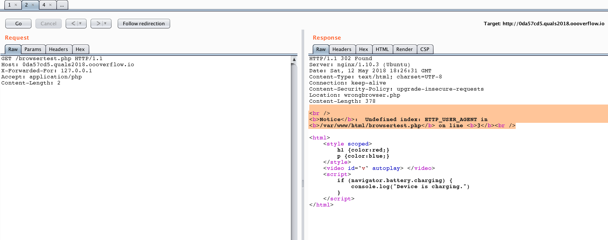

# sbva, Web, 110pts

## Problem

We offer extensive website protection that stops attackers even when the admin's credentials are leaked!

Try our demo page http://0da57cd5.quals2018.oooverflow.io with username:password admin@oooverflow.io:admin to see for yourself.

## Solution

It was a quite tricky challenge, which looks somehow difficult at the beginning. The only thing we've got was a simple login form and when I've put credentials provided, I immediately stuck with the page said that ```Incompatible browser detected.``` (served by the file named ```wrongbrowser.php```)

So it was clear that solution is somewhere around User-Agent string.

First thing I've tried was some simple XSS and SQLi payloads, like typical _skiddie_, with expected result (I mean - no result at all). The next try was to get rid off User-Agent completely:





Then I've realized the fact that this weird HTML has to be some clue:

```html
<html>
    <style scoped>
        h1 {color:red;}
        p {color:blue;} 
    </style>
    <video id="v" autoplay> </video>
    <script>
        if (navigator.battery.charging) {
            console.log("Device is charging.")
        }
    </script>
</html>

```

Why such weird "page" was put into something which the only thing to do was to redirect to ```wrongbrowser.php```?
And why this code checks if my battery is charging?


Wait a second... ```navigator.battery``` is not supported already in many browsers or its newer API ```navigator.getBattery()``` should be used. And why the hell someone used ```scoped``` attribute for ```<style>``` element, which is not supported by any current browser? (https://caniuse.com/#search=scoped)

But, it's supported by Firefox from version 21 up to 54. And ```navigator.battery``` is supported as well by Firefox from 16 (from 11 by enabling a flag in the settings) up to 42 (later versions supports only ```navigator.getBattery()```) - check https://caniuse.com/#search=battery

And ```autoplay``` attribute in ```<video>``` tag is supported by almost all browsers inlcuding above.

Ok, so what if I spoof User-Agent string with Firefox version supporting all ```autoplay```, ```scoped``` and ```navigator.battery```?

Let's check then with Firefox 42, which meets those requirements:

```
GET /browsertest.php HTTP/1.1
Host: 0da57cd5.quals2018.oooverflow.io
Accept: application/php
User-Agent: Mozilla/5.0 (X11; Ubuntu; Linux i686; rv:42.0) Gecko/20100101 Firefox/42.0
Content-Length: 2
```

Aaaand here we are:

```
HTTP/1.1 200 OK
Server: nginx/1.10.3 (Ubuntu)
Date: Sat, 12 May 2018 17:55:36 GMT
Content-Type: text/html; charset=UTF-8
Connection: keep-alive
Content-Security-Policy: upgrade-insecure-requests
Content-Length: 291

OOO{0ld@dm1nbr0wser1sth30nlyw@y}
<html>
    <style scoped>
        h1 {color:red;}
        p {color:blue;} 
    </style>
    <video id="v" autoplay> </video>
    <script>
        if (navigator.battery.charging) {
            console.log("Device is charging.")
        }
    </script>
</html>
```


**Flag: OOO{0ld@dm1nbr0wser1sth30nlyw@y}**
